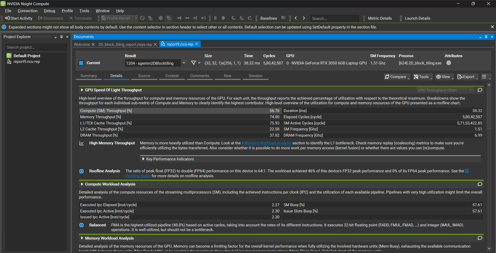
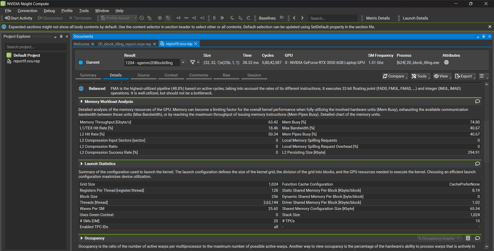
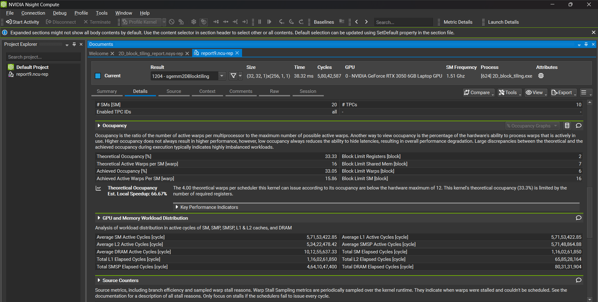
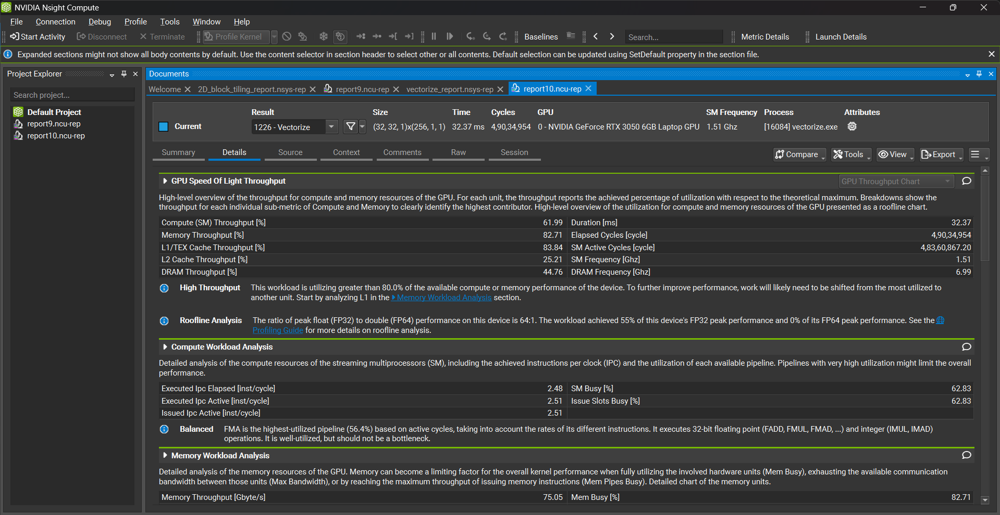
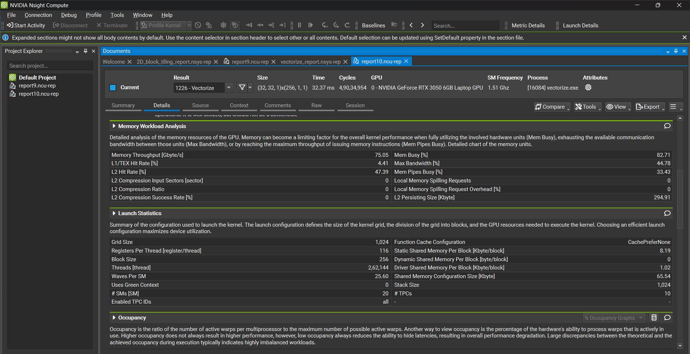
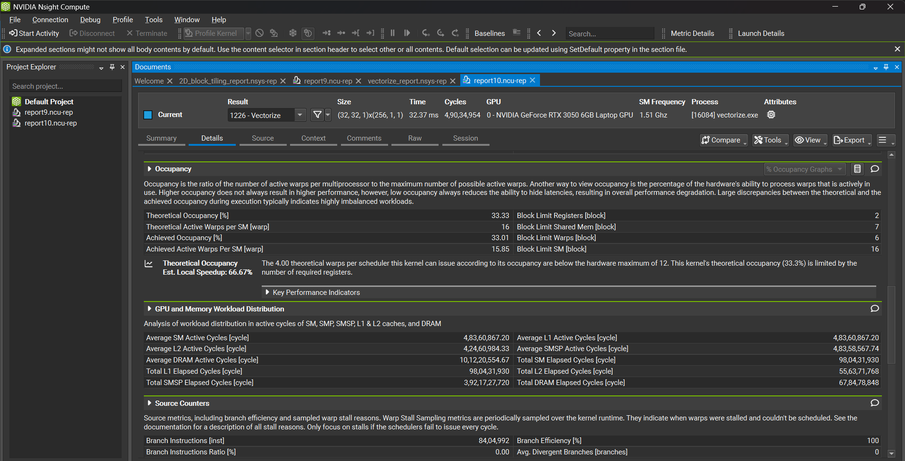

# Implementation Details

All builds were performed on an RTX 3050 (compute capability 8.6) with the CUDA 13.0 toolkit.
## Naive
- **Thread mapping** - One thread per output element (C[x,y]).
- **Memory layout** - Row‑major A and B.
- **Computation** - Simple for (i=0;i<K;i++) acc += A[x*K+i] * B[i*N+y];
- **Kernel launch** - dim3 block(16,16); grid = ceil(M/16) × ceil(N/16).
- **Performance	Baseline** – suffers from non‑coalesced loads, no reuse, and no register blocking.

## Global-Memory Coalescing
- **1‑D block, BLOCKSIZE×BLOCKSIZE threads** - Guarantees each warp accesses consecutive elements of A and B.
- **Thread index → (row, col) mapping** - cRow = blockIdx.x*BLOCKSIZE + threadIdx.x/BLOCKSIZE etc.
- **No shared memory** – still a big win because the memory traffic is now fully coalesced.

## Shared-Memory Blocking
- **Tile size (BLOCKSIZE = 32)** - Each block loads a 32×32 tile of A and B into shared memory.
- **Coalesced loads into shared memory** - Threads read contiguous rows/columns → one transaction per warp.
- **Reuse** - Once a tile is in shared memory, it is used for BLOCKSIZE multiply‑accumulate steps, reducing global‑memory traffic by a factor of BLOCKSIZE.
- **No register blocking (still one result per thread)** - Simpler to verify before adding further register tiling.

## 1D-Block Tiling with Register Blocking
- **Two‑level tiling (BM×BN tile per block, BK inner‑tile)** - Reduces global traffic and improves L2 hit‑rate.
- **Register blocking (TM rows per thread)** - Each thread computes TM rows, keeping intermediate results in registers → fewer shared‑memory writes.
- **Shared‑memory tiles for A and B** -	Same reuse benefit as in 2.3.

## 2D Block Tiling
- **2‑D tile (BM×BN) + inner tile (BK)** - Each thread now computes a subtile. 
- **Thread‑level register blocking (TM×TN)** - Each thread produces a small sub‑matrix, keeping the partial sums in registers.
- **Shared‑memory double‑buffering (implicit via __syncthreads)** - Allows reuse of A/B tiles across the K‑loop.

## Vectorized 2D Block Tiling
- **float4 loads/stores** - 4× bandwidth per transaction, reduces instruction count.
- **Same shared‑memory tiling & register blocking as 2‑D version** - Keeps the high reuse already achieved.
- **Thread‑level vector stores** - Writes 4 results at once, preserving coalescing.
- **Conditional tile size (64 vs 128)** - Guarantees enough threads for the chosen TM/TN.

## Autotuning 2D Block Tiling
- **Compile‑time tuning constants (K9_BM, K9_BN, K9_BK, K9_TM, K9_TN)** - Chosen for RTX 3050 after a short empirical sweep.
- **Warp‑tile (WM = TM*16, WN = TN*16)** - Each warp computes a 16×16 sub‑tile → better occupancy and register reuse.
- **Vectorised loads (float4) + transposition of A** - aligned with the warp‑tile layout.

## cuBLAS Baseline
- The driver simply calls cublasSgemm with the same alpha, beta, and matrix dimensions.

# Performace Analysis
For M=N=K=4096, alpha = 0.5, beta = 3.0
| Implementation             | Time (s) | GFLOPS | % of cuBLAS | Speedup vs Naive |
| -------------------------- | -------- | ------ | ----------- | ---------------- |
| **Naive**                  | 0.952    | 144.4  | 2.87%       | 1.00×            |
| **Global Memory Coalesce** | 0.269    | 511.8  | 10.16%      | 3.55×            |
| **Shared Memory Block**    | 0.201    | 684.6  | 13.59%      | 4.74×            |
| **1D Block Tiling**        | 0.065    | 2111.8 | 41.92%      | 14.63×           |
| **2D Block Tiling**        | 0.034    | 4015.5 | 79.70%      | 27.81×           |
| **Vectorize**              | 0.029438 | 4668.7 | 92.67%      | 32.32×           |
| **Autotuning**             | 0.027472 | 5002.8 | 99.30%      | 34.63×           |
| **CuBLAS**                 | 0.027311 | 5038.0 | 100.00%     | 34.89×           |

# Profiling Results
I have provided the Profiling Results for 2D Block Tiling and Vectorized 2D Block Tiling versions. 

## 2D Block Tiling

## Vectorized 2D Block Tiling

